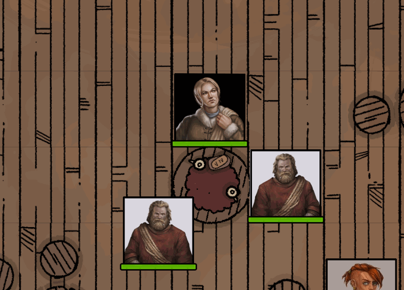

# Token-Mirror-Button
A small module for Foundry VTT that lets you mirror/flip token images with a HUD button

# Example

# Installation
Install from the Foundry module installer or by inputting this manifest link in "Manifest URL" field: https://raw.githubusercontent.com/maclavell/token-mirror-button/master/module.json
